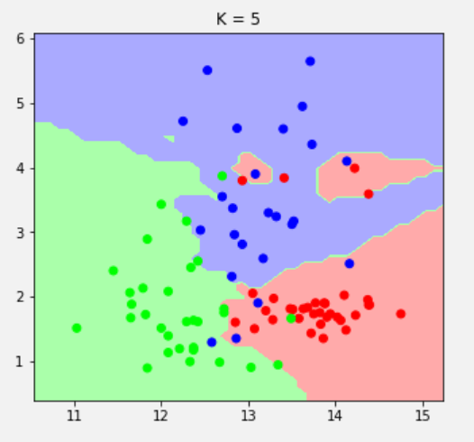

You can find my results on my github: https://github.com/Barrel-Titor/homework-MLDL


# KNN

## 1. Load Wine dataset

```python
from sklearn.datasets import load_wine
data, target = load_wine(True)
```


## 2. Select two attributes

```python
data = data[:, :2]
data.shape	# (178, 2)
```


## 3. Split data into train, validation and test

Use train_test_split twice to randomly cut data into three sets, with proportion 5: 2: 3

```python
from sklearn.model_selection import train_test_split

# Train V.S. Val + Test
X_train, X_test, y_train, y_test = train_test_split(
    data, target, test_size=0.5, random_state=0
)

# Train V.S. Val V.S. Test
X_val, X_test, y_val, y_test = train_test_split(
    X_test, y_test, test_size=0.6, random_state=0
)

len(y_train), len(y_val), len(y_test)	# (89, 35, 54)
```


## 4. Try K = [1, 3, 5, 7]

Define function `plot_boundary`, using `plt.contourf()` to help visualize the decision boundaries of KNN

```python
lc1 = ListedColormap(['#FFAAAA','#AAFFAA','#AAAAFF'])
lc2 = ListedColormap(['#FF0000','#00FF00','#0000FF'])

def plot_boundary(func, points, labels):
    x_min = X_train[:, 0].min() - .5
    x_max = X_train[:, 0].max() + .5
    y_min = X_train[:, 1].min() - .5
    y_max = X_train[:, 1].max() + .5
    h = 0.1

    xx, yy = np.meshgrid(np.arange(x_min, x_max, h), np.arange(y_min, y_max, h))
    Z = func.predict(np.c_[xx.ravel(), yy.ravel()])
    Z = Z.reshape(xx.shape)

    plt.contourf(xx, yy, Z, cmap=lc1)
    plt.scatter(points[:, 0], points[:, 1], c=labels, cmap=lc2)
```


Define function `K_KNN` to fit data and validate

```python
def K_KNN(K):
    clf = KNeighborsClassifier(K)
    clf.fit(X_train, y_train)
    clf_list.append(clf)
    plot_boundary(clf, X_train, y_train)
    y_val_predicted = clf.predict(X_val)
    accuracy = np.mean(y_val_predicted == y_val) * 100
    accuracies.append(accuracy)
```


The results look as follows:





## 5. Show accuracy on validation set


It shows it's better when K = 5


## 6. How the boundaries change?

When K is too small, neighborhood of each point is very small, which can lead to overfitting. Therefore, the boundary can be easily disturbed by noise and outliers.

As K increases, the boundary becomes simpler has more powerful generalization capabilities. However, if K is too large, points of different labels become its neighbors and the accuracy will become lower.


## 7. Use the best value of K on the test set

```python
y_test_predicted = clf_list[2].predict(X_test)
accuracy = np.mean(y_test_predicted == y_test) * 100
accuracy	# 75.92592592592592
```


# Linear SVM

## 8. Try C = [0.001, 0.01, 0.1, 1, 10, 100,1000]

Use `plot_boundary` above to plot decision boundary of SVM


## 9. Show accuracy on validation set


It seems when C >= 1, the accuracy doesn't vary much.


## 10. How the boundaries change?

The larger the value of C, the greater the penalty for outliers, and the less willing the classifier is to allow outliers.


## 11.Use the best value of C on the test set

```python
accuracy = np.mean(y_test_predicted == y_test) * 100
accuracy	# 79.62962962962963 when C = 1
accuracy	# 83.33333333333334 when C = 10
accuracy	# 83.33333333333334 when C = 100
accuracy	# 83.33333333333334 when C = 1000
```


# SVM with RBF Kernel

## 12. Repeat point 8. (train, plot) but using RBF kernel


 

## 13. Evaluate the best C on the test set

```python
accuracies	# [20.0, 20.0, 20.0, 60.0, 71.42857142857143, 68.57142857142857, 77.14285714285715]
y_test_predicted = clf_list[6].predict(X_test)
accuracy = np.mean(y_test_predicted == y_test) * 100
accuracy	# 81.48148148148148
```


## 14. Differences compared to the linear kernel

The boundaries become non-linear because of the kernel.


## 15. Perform grid search for both gamma and C at the same time

By checking the source code of `svm.SVC()`, I calculate two default values of gamma

```python
# value of gamma='scale' in SVC
1 / (X_train.shape[0] * X_train.var())	# 0.000377073287583712

# value of gamma='auto' in SVC
1 / (X_train.shape[0])	# 0.011235955056179775
```

Therefore I try gamma from 1e-5 to 1, and C from 0.1 to 1000

```python
best_score = 0
for gamma in [1e-5, 1e-4, 1e-3, 1e-2, 0.1, 1]:
    for C in [0.1, 1, 10, 100, 1000]:
        clf = svm.SVC(gamma=gamma,C=C)
        clf.fit(X_train,y_train)
        score = clf.score(X_val, y_val)
        if score > best_score:
            best_score = score
            best_parameters = {'gamma':gamma,'C':C}
            best_clf = deepcopy(clf)
```

Best parameters are as follow:

```python
best_score, best_parameters	# (0.8571428571428571, {'C': 1000, 'gamma': 0.1})
best_clf.score(X_test, y_test)	# 0.7777777777777778
```


# K-Fold

## 16. Merge training and validation split

```python
X_train.shape, X_val.shape	# ((89, 2), (35, 2))

X_train = np.concatenate((X_train, X_val), axis=0)
y_train = np.concatenate((y_train, y_val), axis=0)
X_train.shape, y_train.shape	# ((124, 2), (124,))
```


## 17. Grid search with 5-fold cross validation for gamma and C 

`sklearn.model_selection` provides `GridSearchCV` for grid search with cross validation

```python
params = {
    "gamma": [1e-5, 1e-4, 1e-3, 1e-2, 0.1, 1],
    "C": [0.1, 1, 10, 100, 1000]
}
grid = GridSearchCV(svm.SVC(), params, cv=5)
grid.fit(X_train, y_train)
```


## 18. Evaluate on test set

```python
grid.best_score_, grid.best_params_	# (0.8226666666666667, {'C': 1000, 'gamma': 0.1})
grid.score(X_test, y_test)	# 0.7777777777777778
```


# Extra

## 19. Discuss the difference between KNN and SVM

1. SVM is less affected by outliers than KNN
2. Once SVM is trained, we can quickly predict labels, while we don't have a training phase on KNN and we have to calculate distances with neighbors every time new data comes in


## 20. Try also with different pairs of attributes

Methodology is the same with above. Using `GridSearchCV` is convenient and the result is reliable

I choose the 5th and 6th dimensions to perform SVM with RBF kernel


```python
grid.best_score_, grid.best_params_	# (0.7993333333333333, {'C': 1000, 'gamma': 1})
grid.score(X_test, y_test)	# 0.7592592592592593
```

Decision boundary: 


