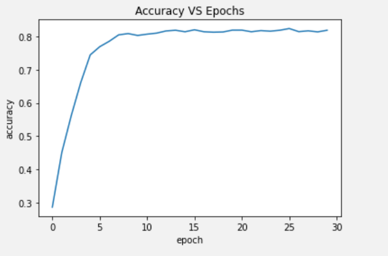

You can find my results on my github: https://github.com/Barrel-Titor/homework-MLDL


# Data preparation

`caltech_dataset.py` given by https://github.com/MachineLearning2020/Homework2-Caltech101 is incomplete. Quindi the complete code is as follows:

```diff
 class Caltech(VisionDataset):
     def __init__(self, root, split='train', transform=None, target_transform=None):
         super(Caltech, self).__init__(root, transform=transform, target_transform=target_transform)
 
         if split != 'train' and split != 'test':
             raise ValueError("should take 'train' or 'test' as value of 'split'")
 
         self.split = split # This defines the split you are going to use
                            # (split files are called 'train.txt' and 'test.txt')
 
+        self.root = root
+        self.transform = transform
+        self.target_transform = target_transform
+        self.img_list = []
+
+        self.label_list = [x.name for x in os.scandir(self.root)]
+        self.label_list.sort()
+        self.label_list.remove('BACKGROUND_Google')
+
+        self.split_ = os.path.join(self.root, '..', self.split + '.txt')
+
+        with open(self.split_, 'r') as f:
+            for line in f:
+                line = line.strip('\n')
+                label = line.split('/')[0]
+                if label != 'BACKGROUND_Google':
+                    self.img_list.append((line, self.label_list.index(label)))

     def __getitem__(self, index):
-        image, label = ...
+        path, label = self.img_list[index]
+        image = pil_loader(os.path.join(self.root, path))

         if self.transform is not None:
             image = self.transform(image)

         return image, label

     def __len__(self):
-		 length = ...
+        length = len(self.img_list)
         return length
```

If any string, except 'train' and 'test', is provided for the argument `split`, it will raise an error.

`BACKGROUND_Google` is removed from the label_list. Besides, whenever a line in `train.txt` and `test.txt` is started with `BACKGROUND_Google`, that line is ignored.


# Training from scratch

## A. Split training set in training and validation sets

In order to balance the number of images of each folder in train set and validation set, `train_indexes` and `val_indexes` are selected as [0, 2, 4, ...] and [1, 3, 5, ...]

```python
train_val_dataset = Caltech(DATA_DIR, split='train',  transform=train_transform)
test_dataset = Caltech(DATA_DIR, split='test', transform=eval_transform)

train_indexes = list(range(0, len(train_val_dataset), 2))
val_indexes = list(range(1, len(train_val_dataset), 2))

train_dataset = Subset(train_val_dataset, train_indexes)
val_dataset = Subset(train_val_dataset, val_indexes)
```


## B. Model selection with validation

Since I have to evaluate the model every training epoch, I combine the train part and validation part given by the template in one epoch.

Hyperparameters are the default ones:

| Current hyperparameters | Value     |
| ----------------------- | --------- |
| Initial learning rate   | 0.001     |
| Decaying policy         | StepLR    |
| Decaying step size      | 20 epochs |
| Decaying factor         | 0.1       |
| Optimizer               | SGD       |
| Epochs                  | 30        |

Use only the best performing model on the validation set for testing

```python
# Start iterating over the epochs
for epoch in range(NUM_EPOCHS):
    print('Starting epoch {}/{}, LR = {}'.format(epoch+1, NUM_EPOCHS, scheduler.get_last_lr()))

    # Train part
    net.train() # Sets module in training mode

    # Iterate over the dataset
    for images, labels in train_dataloader:
        # Bring data over the device of choice
        images = images.to(DEVICE)
        labels = labels.to(DEVICE)

        # PyTorch, by default, accumulates gradients after each backward pass
        # We need to manually set the gradients to zero before starting a new iteration
        optimizer.zero_grad() # Zero-ing the gradients

        # Forward pass to the network
        outputs = net(images)

        # Compute loss based on output and ground truth
        loss = criterion(outputs, labels)

        # Log loss
        if current_step % LOG_FREQUENCY == 0:
            print('Step {}, Loss {}'.format(current_step, loss.item()))

        # Compute gradients for each layer and update weights
        loss.backward()  # backward pass: computes gradients
        optimizer.step() # update weights based on accumulated gradients

        current_step += 1

    # Step the scheduler
    scheduler.step() 

    # Use the best model for validation
    if not loss_hist or loss.item() < min(loss_hist):
        best_net = deepcopy(net)

    # Validation part
    best_net.train(False) # Set Network to evaluation mode

    running_corrects = 0
    with torch.no_grad():
        for images, labels in val_dataloader:
            images = images.to(DEVICE)
            labels = labels.to(DEVICE)

            # Forward Pass
            outputs = best_net(images)

            # Get predictions
            _, preds = torch.max(outputs.data, 1)
            
            # Update Corrects
            running_corrects += torch.sum(preds == labels.data).data.item()

    # Calculate Accuracy
    accuracy = running_corrects / float(len(val_dataset))
    print('Accuracy {}\n'.format(accuracy))

    # Record loss and accuracy after each epoch
    loss_hist.append(loss.item())
    acc_hist.append(accuracy)
```


## C. Try 2 sets of hyperparameters

| Current hyperparameters | Value     |
| ----------------------- | --------- |
| Initial learning rate   | 0.1       |
| Decaying policy         | StepLR    |
| Decaying step size      | 20 epochs |
| Decaying factor         | 0.1       |
| Optimizer               | SGD       |
| Epochs                  | 30        |


```python
test_accuracy	# 0.39094365710335294
```


| Current hyperparameters | Value     |
| ----------------------- | --------- |
| Initial learning rate   | 0.1       |
| Decaying policy         | StepLR    |
| Decaying step size      | 10 epochs |
| Decaying factor         | 0.3       |
| Optimizer               | SGD       |
| Epochs                  | 30        |


```python
test_accuracy	# 0.27134462495679224
```


# Transfer learning and Data augmentation

## A. Load AlexNet with weights trained on ImageNet

Pytorch already provides methods to load weights

```python
net = alexnet(pretrained=True)
```


## B. Change the normalize function

Reading Pytorch documents, I find that mean of ImageNet is [0.485, 0.456, 0.406], and standard deviation [0.229, 0.224, 0.225]


## C. Try 3 sets of hyperparameters

Since this is the procedure of fine tuning, I set the initial learning rate a small number.

| Current hyperparameters | Value     |
| ----------------------- | --------- |
| Initial learning rate   | 0.001     |
| Decaying policy         | StepLR    |
| Decaying step size      | 10 epochs |
| Decaying factor         | 0.1       |
| Optimizer               | SGD       |
| Epochs                  | 30        |




```python
test_accuracy	# 0.8212927756653993
```


| Current hyperparameters | Value    |
| ----------------------- | -------- |
| Initial learning rate   | 0.001    |
| Decaying policy         | StepLR   |
| Decaying step size      | 5 epochs |
| Decaying factor         | 0.1      |
| Optimizer               | SGD      |
| Epochs                  | 30       |


```python
test_accuracy	# 0.7684064984445212
```


I also try different scheduler `torch.optim.lr_scheduler.ReduceLROnPlateau`

> Reduce learning rate when a metric has stopped improving. Models often benefit from reducing the learning rate by a factor of 2-10 once learning stagnates. This scheduler reads a metrics quantity and if no improvement is seen for a ‘patience’ number of epochs, the learning rate is reduced.

| Current hyperparameters | Value             |
| ----------------------- | ----------------- |
| Initial learning rate   | 0.001             |
| Decaying policy         | ReduceLROnPlateau |
| Decaying factor         | 0.1               |
| Decaying patience       | 3 epochs          |
| Optimizer               | SGD               |
| Epochs                  | 30                |


```python
test_accuracy	# 0.832353957829243
```

This set of hyperparameters performs best, so I use it in the following sections.


## D. Experiment by training only the FC layers

Only one line needs to be modified compared with above:

```diff
  criterion = nn.CrossEntropyLoss()
- parameters_to_optimize = net.parameters()
+ parameters_to_optimize = net.classifier.parameters()
  optimizer = optim.SGD(parameters_to_optimize, lr=LR, momentum=MOMENTUM, weight_decay=WEIGHT_DECAY)
  scheduler = optim.lr_scheduler.ReduceLROnPlateau(optimizer, factor=FACTOR, patience=PATIENCE)
```


```python
test_accuracy	# 0.8354649153128241
```

The result doesn't vary much, but the speed up is obvious


## E. Experiment by training only the Conv layers

```diff
  criterion = nn.CrossEntropyLoss()
- parameters_to_optimize = net.parameters()
+ parameters_to_optimize = net.features.parameters()
  optimizer = optim.SGD(parameters_to_optimize, lr=LR, momentum=MOMENTUM, weight_decay=WEIGHT_DECAY)
  scheduler = optim.lr_scheduler.ReduceLROnPlateau(optimizer, factor=FACTOR, patience=PATIENCE)
```


```python
test_accuracy	# 0.3328724507431732
```

The result seems awful, but at least better than that not using transfer learning.


## Data Augmentation

Checking Pytorch documentation, I select 3 sets of transforms for training images:

- transforms.RandomCrop(224)
- transforms.RandomHorizontalFlip()
- transforms.ColorJitter()

And I don't use data augmentation methods on test images.

Therefore the code is as follows:

```python
train_transform = transforms.Compose([transforms.Resize(256),
                                      transforms.RandomCrop(224),  
                                      transforms.RandomHorizontalFlip(),
                                      transforms.ColorJitter(),    
                                      transforms.ToTensor(),
                                      transforms.Normalize([0.485, 0.456, 0.406], [0.229, 0.224, 0.225])

eval_transform = transforms.Compose([transforms.Resize(256),
                                     transforms.CenterCrop(224),
                                     transforms.ToTensor(),
                                     transforms.Normalize([0.485, 0.456, 0.406], [0.229, 0.224, 0.225])
```


# Try ResNet18

Fortunately the input size of ResNet18 is also 224 \* 224, thus there aren't much differences in code.


```python
test_accuracy	# 0.6864846180435534
```


