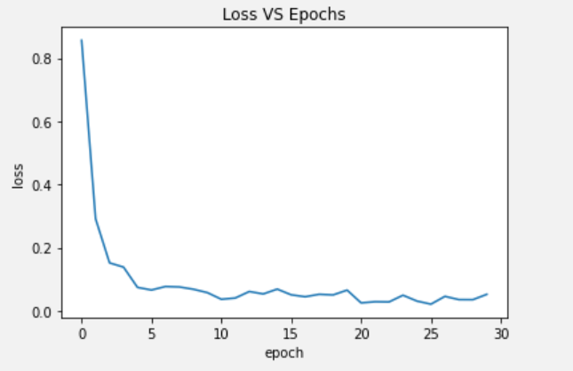
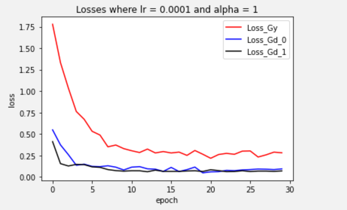

You can find my results on my github: https://github.com/Barrel-Titor/homework-MLDL


# Implementation of DANN

There are 3 parts of DANN: feature extractor $ G_f $, label predictor $ G_y $ and domain classifier $ G_d $

The idea is like training GAN, but according to the paper, a gradient reversal layer is used for combining feature extractor $ G_f $ and domain classifier $ G_d $.


The implementation of DANN is as follows:

```python
from PACS.gradient_reversal_example import ReverseLayerF
from torchvision.models import AlexNet
from torchvision.models.utils import load_state_dict_from_url
from copy import deepcopy

model_urls = {
    'alexnet': 'https://download.pytorch.org/models/alexnet-owt-4df8aa71.pth',
}


class DANN(AlexNet):
    def __init__(self):
        super(DANN, self).__init__()
        self.domain_clf = nn.Sequential(
            nn.Dropout(),
            nn.Linear(256 * 6 * 6, 4096),
            nn.ReLU(inplace=True),
            nn.Dropout(),
            nn.Linear(4096, 4096),
            nn.ReLU(inplace=True),
            nn.Linear(4096, 2),
        )
    
    def forward(self, x, alpha=None):
        x = self.features(x)
        x = self.avgpool(x)
        # Flatten the features:
        x = x.view(x.size(0), -1)
        # If we pass alpha, we can assume we are training the discriminator
        if alpha is not None:
            # gradient reversal layer (backward gradients will be reversed)
            reverse_feature = ReverseLayerF.apply(x, alpha)
            discriminator_output = self.domain_clf(x)
            return discriminator_output
        # If we don't pass alpha, we assume we are training with supervision
        else:
            # do something else
            class_outputs = self.classifier(x)
            return class_outputs

def dann(pretrained=False, progress=True, **kwargs):
    r"""AlexNet model architecture from the
    `"One weird trick..." <https://arxiv.org/abs/1404.5997>`_ paper.
    Args:
        pretrained (bool): If True, returns a model pre-trained on ImageNet
        progress (bool): If True, displays a progress bar of the download to stderr
    """
    model = DANN(**kwargs)
    if pretrained:
        state_dict = load_state_dict_from_url(model_urls['alexnet'],
                                              progress=progress)
        model.load_state_dict(state_dict, strict=False)
    return model
```

When we want data flow from feature extractor $ G_f $ to label predictor $ G_y $, we simply use `outputs = net(input)`

When we want data flow from feature extractor $ G_f $ to domain classifier $ G_d $, we additionally transfer a hyperparameter `ALPHA` which should be optimized later: `outputs = net.forward(input, ALPHA)` 


# Train on P and test on A without adaptation

Training without domain adaptation is just like Homework2, using AlexNet.




```python
test_accuracy	# 0.46484375
```


# Train on P and test on A with DANN

Each training epoch is divided into 3 parts before calling `optimizer.step()`

1. Data flow from $G_f$ to $G_y$, training $G_y$ by source data and labels;
2. Data flow from $G_f$ to $G_d$, training $G_d$ by **source data and labels of all 0**, and with the help of gradient reversal layer, training $G_f$ to cheat the domain classifier $G_d$
3. Data flow from $G_f$ to $G_d$, training $G_d$ by **target data and labels of all 1**, and with the help of gradient reversal layer, training $G_f$ to cheat the domain classifier $G_d$

Before training, there is an additional step, i.e. copying weights of label classifier into domain classifier

```python
net.domain_clf[1].weight.data = net.classifier[1].weight.data
net.domain_clf[1].bias.data = net.classifier[1].bias.data

net.domain_clf[4].weight.data = net.classifier[4].weight.data
net.domain_clf[4].bias.data = net.classifier[4].bias.data
```

Training phase is as follows:

```python
# By default, everything is loaded to cpu
net = net.to(DEVICE) # this will bring the network to GPU if DEVICE is cuda

cudnn.benchmark # Calling this optimizes runtime

loss_Gy_hist = []
loss_Gd_0_hist = []
loss_Gd_1_hist = []

# Start iterating over the epochs
for epoch in range(NUM_EPOCHS):
  print('Starting epoch {}/{}, LR = {}'.format(epoch+1, NUM_EPOCHS, scheduler.get_last_lr()))

  # Iterate over the dataset
  for images, labels in train_dataloader:
    # Bring data over the device of choice
    images = images.to(DEVICE)
    labels = labels.to(DEVICE)

    net.train() # Sets module in training mode

    # PyTorch, by default, accumulates gradients after each backward pass
    # We need to manually set the gradients to zero before starting a new iteration
    optimizer.zero_grad() # Zero-ing the gradients

    # 3B.1 Train Gy
    # Forward pass to the network
    outputs = net(images)

    # Compute loss based on output and ground truth
    loss = criterion(outputs, labels)

    loss.backward()  # backward pass: computes gradients

    # 3B.2 Train Gd by forwarding source data
    label_outputs = net.forward(images, ALPHA)
    targets = torch.zeros(labels.shape, dtype=int).to(DEVICE)

    loss_Gd_0 = criterion(label_outputs, targets)
    loss_Gd_0.backward()

    # 3B.3 Train Gd by forwarding target data
    test_images, test_labels = next(iter(test_dataloader))
    test_images = test_images.to(DEVICE)
    test_labels = test_labels.to(DEVICE)

    test_label_outputs = net.forward(test_images, ALPHA)
    targets = torch.ones(test_labels.shape, dtype=int).to(DEVICE)

    loss_Gd_1 = criterion(test_label_outputs, targets)
    loss_Gd_1.backward()

    # update weights based on accumulated gradients
    optimizer.step() 

  # Step the scheduler
  scheduler.step()

  # Log loss
  print('Gy  Loss {}'.format(loss.item()))
  print('Gd0 Loss {}'.format(loss_Gd_0.item()))
  print('Gd1 Loss {}'.format(loss_Gd_1.item()))

  # Record loss and accuracy after each epoch
  loss_Gy_hist.append(loss.item())
  loss_Gd_0_hist.append(loss_Gd_0)
  loss_Gd_1_hist.append(loss_Gd_1)
```


```python
test_accuracy	# 0.49169921875
```


# Hyperparameter optimization

Since there are too many outputs during training, I use logs to record the prints.

```python
logger = logging.getLogger(__name__)
logger.setLevel(logging.DEBUG)
logname = 'DANN.log'
handler = logging.FileHandler(logname)
formatter = logging.Formatter(
    '%(asctime)s - %(levelname)s - %(lineno)d - %(message)s'
)
handler.setFormatter(formatter)
logger.addHandler(handler)

logger.info('Starting epoch {}/{}, LR = {}, alpha = {}'.format(
                epoch+1, NUM_EPOCHS, scheduler.get_last_lr(), alpha
                ))
...
```

I have

```python
lr_choices = [1e-3, 1e-4, 1e-5]
alpha_choices = [0.1, 0.3, 1, 3, 10]
```

and perform the grid search.

```python
for lr in lr_choices:
    for alpha in alpha_choices:
        # prepare network and optimizer
        ...
        
        # training, with three parts as mentioned before
        ...
        
        # testing
        ...
        
        # save the lr, alpha and net parameters with best accuracy
        ...
```


```python
test_accuracy	# 0.482421875
```


```python
test_accuracy	# 0.48291015625
```


```python
test_accuracy	# 0.45263671875
```


```python
test_accuracy	# 0.48388671875
```


```python
test_accuracy	# 0.484375
```


```python
test_accuracy	# 0.45947265625
```


```python
test_accuracy	# 0.42431640625
```




```python
test_accuracy	# 0.43505859375
```


```python
test_accuracy	# 0.3798828125
```


```python
test_accuracy	# 0.43017578125
```


```python
test_accuracy	# 0.25244140625
```


```python
test_accuracy	# 0.228515625
```


```python
test_accuracy	# 0.25537109375
```


```python
test_accuracy	# 0.265625
```


```python
test_accuracy	# 0.22802734375
```

We find that low `lr` behaves very bad. When `lr` is big enough, usually a big `alpha` performs a little bit better.

```python
best_lr, best_alpha, best_accuracy	# (0.001, 10, 0.484375)
```


